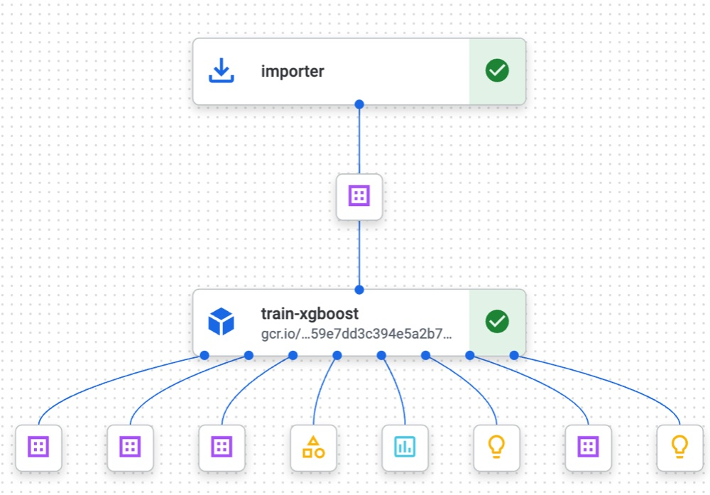

In an ML pipeline, a component is a self-contained unit of code that performs a specific task. Components break down complex ML workflows into modular and manageable units. Each component typically performs one step in the workflow such as feature engineering, data preprocessing or model training. 

Components are designed to be **modular** allowing developers to focus on specific tasks without having to understand the entire pipeline. Preferably they are also **reusable** and **isolated**, so they can be used in multiple pipelines and changes in one component don’t necessarily impact others. 

A component is generally defined by an interface, where inputs, outputs and dependencies are specified. Additionally, containerization is commonly used to package components and ensure consistency across different environments and executions.

In Kubeflow, all the components are defined by a container image, a command to execute and a set of arguments. This information is commonly stored in a yaml file. Depending on the complexity of the component and the experience of the developer components can be defined in three ways:

* **Lightweight Python components:** these components are simply defined by a python function and a @dsl.component decorator. When compiled, the decorator transforms your function into a component that can be executed by a KFP backend. This approach is convenient to start learning about pipelines or writing a very simple component but does not facilitate managing source code with multiple dependencies.
 
* **Containerized Python components:** this recent method to build components is an extension of the previous, it also uses a decorator and it relaxes some of the isolation restrictions of the lightweight components by allowing importing dependencies from additional files and facilitating the building process. 
    
* **Custom components:** these components are fully customizable, the user can define them from the scratch and directly specify the image to use, the command to run and the input and output arguments. They can execute shell scripts, use other languages and binaries, etc., all from within the KFP SDK. They can be manually defined in a yaml file or compiled by a @dsl.container_component. Since they are so flexible and they allow you to manage complex dependencies they are the ones recommended for production. Writing custom components requires more experience with KFP so, in this article, we are going to walk through the process of defining one from the beginning.

The yaml file below is an example of a custom component that executes Python code. 

```
name: My custom component
description: An example KFP custom component
inputs:
- {name: data_artifact_1, type: Dataset, description: 'Lorem ipsum.'}
- {name: my_string_1, type: String, description: 'Lorem ipsum.'}
- {name: my_model_1, type: Model, description: 'Lorem ipsum.'}
- {name: my_dict, type: JsonObject, default: '{}', description: 'Lorem ipsum'}
- {name: my_list, type: JsonArray, default: '[]', optional: True}
- {name: my_artifact, type: Artifact, optional: True, description: 'Lorem ipsum.'}
outputs:
- {name: data_artifact_2, type: Dataset, description: 'Lorem ipsum'}
- {name: string_2, type: 'Lorem ipsum'}
metadata:
annotations:
  author: John Steinbeck <j.steinbeck@monterrey.com>
implementation:
container:
  image: gcr.io/PROJECT_ID/my_component_default_0.0@DIGEST
  args:
  - --executor_input
  - executorInput: null
  - --function_to_execute
  - my_function
  command:
  - python3
  - -m
  - kfp.v2.components.executor_main
  - --component_module_path
  - ./components/my_compoment/src/component.py
```


**Name:** regardless of how you name it, the name will be lowered cased and hyphenated by the KFP compiler when the component is integrated in a pipeline. 

**Inputs:** the list of input parameters to your component. The type can be set to: String, Float, Boolean, JsonObject (dictionary), JsonArray (List), Model, Artifact, Dataset, Metrics, HTML, Markdown. To learn more about data passing between components you can check out [this] article.  

**Outputs:** the list of output parameters. 

**Container - Image:** the address of the image that includes your component source code. If you want to point to an exact version of the container – for example when you are developing and testing a recently built version– remember to add the digest. 

**Args:** this section can be replicated in any component, simply specify the main component function in _–function_to_execute_.

**Command:** To run a python script specify the location of your script within the container in _—component_module_path._ 

Following the KFP SDK the function to be executed in the component would have the following structure:


```
from typing import NamedTuple
from collections import namedtuple
from kfp.v2.dsl import Output, Input, Dataset, HTML, Model, Artifact

def my_function(
   data_artifact_1: Input[Dataset],
   my_model: Input[Model],
   data_artifact_2: Output[Dataset],
   my_string: str = "",
   my_dict: dict = {},
   my_list: list = [],
   my_artifact: Input[Artifact] = None,
)-> NamedTuple("output", [("string_2", str), ("my_integer", int)]):

   # ...

   output = namedtuple("output", ["string_2", "my_integer"])

   return output("foo", 3)
```

To learn more about data passing in KFP components and how to assemble a pipeline you can read these articles [ ] [ ].





